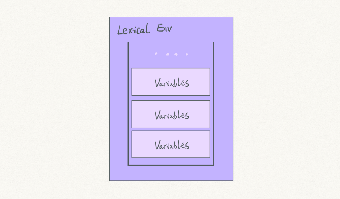
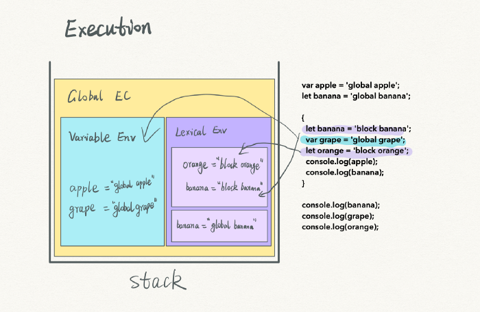
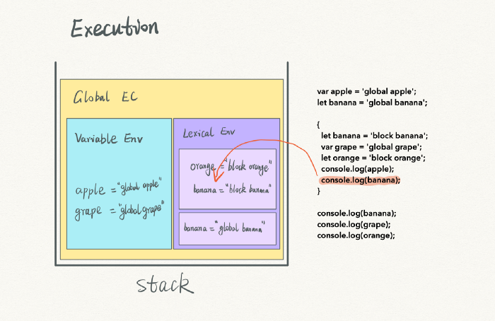
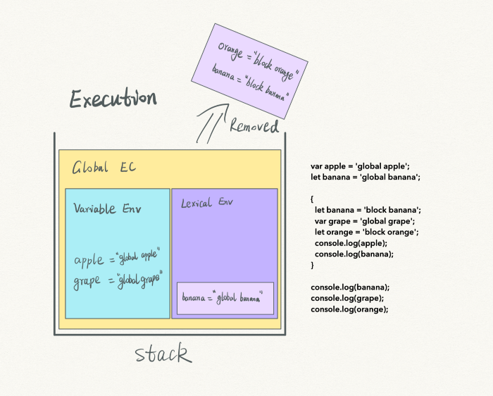
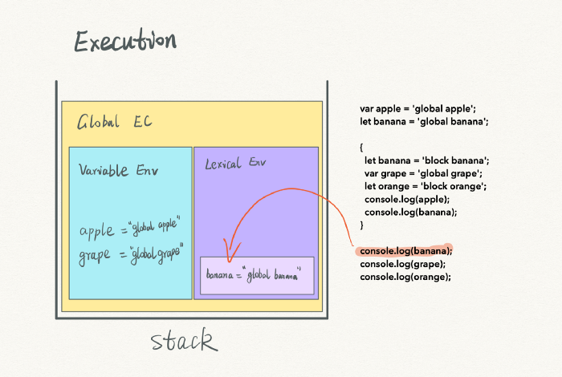
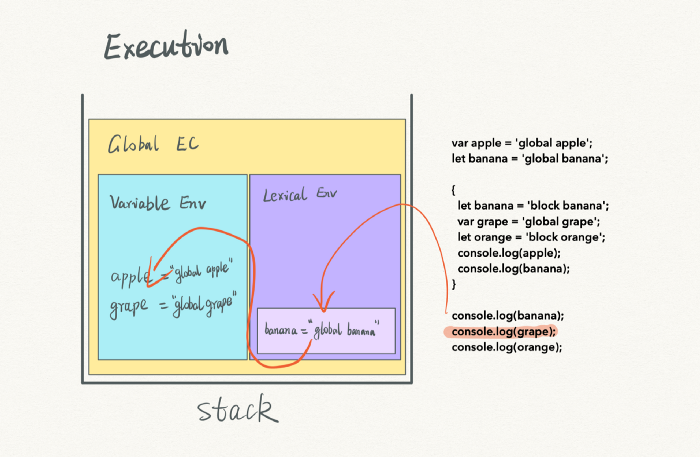
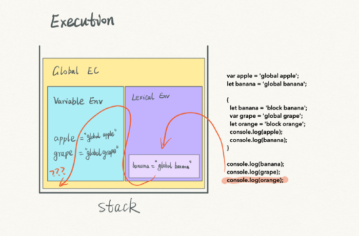

# JavaScript: The Hard Parts, v2[Link Course](https://frontendmasters.com/courses/javascript-hard-parts-v2/)

* * *

## Hoisting

- Hoisting là cơ chế của JavaScript cho phép các khai báo biến hoặc hàm được dời lên trên đầu phạm vi của chúng trước khi thực thi đoạn code.

## Closure

- Là một hàm, ghi nhớ nơi được tạo và có thể truy cập được biến bên ngoài phạm vi (scope).

>Đặc tính:

- it has access to its own scope — variables defined between its curly brackets.
- it has access to the outer function’s variables
- it has access to the global variables.

## Execution Context(EC) - 4 Parts

### [Part I](https://cabulous.medium.com/javascript-execution-context-part-1-from-compiling-to-execution-84c11c0660f5)

Có 2 bước khi chạy JS: biên dịch(compiling) và thực thi(execution).

Một Execution Context được tạo ra tại lúc compiling, bao gồm Variable Environments and other components.

Một biến được khai báo tại lúc bước **compiling** và được gán tại bước **execution**.

### [Part II](https://cabulous.medium.com/javascript-execution-context-part-2-call-stack-and-multiple-execution-contexts-dbe428a94190)

An execution context is always linked to a compiling step. Multiple execution contexts imply many compiling steps.

- Multiple execution contexts:

```js
   var apple = 10;

    function totoal () {
        var price = 2;
        return apple * price;
    }

    var appleTotal = totoal();

    console.log(appleTotal) // 20
```

### [Part III](https://cabulous.medium.com/javascript-execution-context-lexical-environment-and-block-scope-part-3-fc2551c92ce0)

Trong ES6 có 3 loại Scope:

- Global scope

```js
{
    var apple = 'apple';

    if (true) {
        var apple = 'banana'; // Ghi đè lại biến apple ở global
        console.log('if apple: ', apple) //if apple: banana
    }

    console.log('Global apple: ', apple) // Global apple: banana
}
```

- Function scope

```js
/*
    Function as Scope. 💥 Một function có một block scope
*/
var a = 2;

function foo() { // <-- insert this

    var a = 3;
    console.log( a ); // 3

} // <-- and this
foo(); // <-- and this

console.log( a ); // 2
```

- Block scope.

```js
var apple = 'apple';

if (true) {
    let apple = 'banana'; //Biến có let có block scope nên ko ghi đè biến apple ở global
    console.log('if apple: ', apple) //if apple: banana
}

console.log('Global apple: ', apple) // Global apple: apple

```

1. Một số lỗi liên quan đến cơ chế hoisting:
    > Tại thời điểm compiling:
    - Với biến **let**, chỉ có cơ chế hoisting,  **không khởi tạo**(initialization) giá trị mặc định(undefined) và sẽ không được gán value

    - Với biến **var**,có cơ chế hoisting, được khởi tạo(initialization) với giá trị mặc định là undefined và sẽ không được gán value.

    - Với **function declaration**, có cơ chế hoisting, được khởi tạo và gán luôn script cùng 1 lúc

📌 Chú ý

```js
{
    🚩(I'm here)
    if (true) {

    // Trong này ko phải là new scope nhé!
    // Với biến let thì tồn tại trong này như là một block scope
    // Với biến var thì nó sẽ đưa là đầu scope(🚩) hoặc là global scope
    // Đừng nhầm với Function Scope
    // Một function là một scope riêng

    }
}
```

### [Part IV](https://cabulous.medium.com/javascript-execution-context-scope-chain-closure-and-this-part-4-961acd9689c9). Scope Chain, Lexical Scope, Closure, This

#### Scope chain (1)

1. Scope chain được định nghĩa bỏi lexical scope và không bao giờ bị ảnh hưởng bởi call stack.

1. Scope chain được định nghĩa tại thời điểm compiling, không phải bước execution. Một function đã xác định outer ngay từ thời điểm đầu tiền và phụ thuộc vào vị trí mà function định nghĩa(located).

```js
//Scope stack in the lexical environsment
// Với biến let sẽ được store trong LE. Khi chạy đến kí tụ } thì sẽ remove ra khỏi LE
{
    var apple = 'global apple';
    let banana = 'global banana';

    {
        let banana = 'block banana';
        var grape = 'global grape';
        let orange = 'block orange';
        console.log(apple); //global apple
        console.log(banana); //block banana
    }

    console.log(banana); //global banana
    console.log(grape); //undefinded
    console.log(orange); //not defined
}

```

- Biến let được lưu trong Lexical Environment




- Sau khi execution







#### Lexical scope (2)

JavaScript engine có một quy định: lexical scope được xác định tại nơi mà function định nghĩa

🔥 **(1) + (2) => Một biến được tìm kiếm 🔍 thông qua scope chain. Nghĩa là sẽ ưu tiên tìm kiếm variable bên trong function trước(block scope) 👉🏼 lexical scope 👉🏼 global scope(root) dừng lại.**

#### Lexical scope as static scope

```js
{
    var apple = 'apple'
    function isApple () {
        console.log(apple);
    }

    function isBanana () {
        var apple = 'bananna';
        isApple(); //resule: apple,
        //func isAplle được định nghĩa ở global scope
        //nên lexical scope của func isApple global scope
        // => outer của isApple execution context là global execution context
    }

    isBanana();
}
```

#### Dynamic Scope

Javascript không có dynamic scope. Nhưng **this** hoạt động giống như một dynamic scope. Tham khảo thêm:

1. [Javascript — Lexical and Dynamic Scoping?](https://medium.com/@osmanakar_65575/javascript-lexical-and-dynamic-scoping-72c17e4476dd)

1. [JS scope: static, dynamic, and runtime-augmented](https://codeburst.io/js-scope-static-dynamic-and-runtime-augmented-5abfee6223fe) ✅

Example:

1. Closure

1. This like Dynamic Scope

📝[Full Source EC](ExecutionContext/ExecutionContext.js)

* * *

